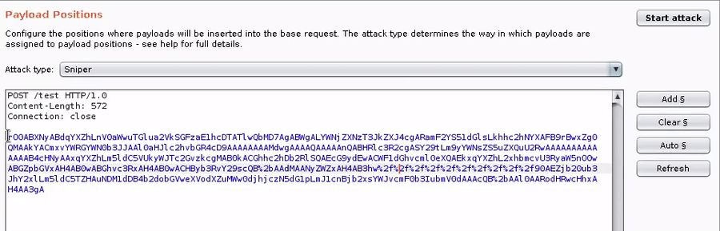
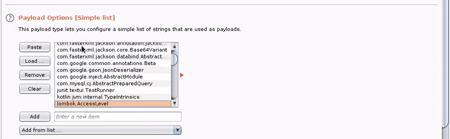

#


## Description

You just found a Java deserialization bug, you ran all your ysoserial payloads, and.... you got nothing. What now? How can you debug or build a gadget chain if you're totally blind?

Introducing ClazzScope, a tool that shines a light on remote classpaths and raises bug severity for all!

ClazzScope takes a wordlist of Java classes and serialVersionUID, outputs serialized DNS callback objects, and reports what's lurking in the remote classpath.

### Burp Extension Usage

The Burp extension automatically integrates with Burp Collaborator to handle DNS callbacks. The extension also includes signatures and an analyzer to identify library versions of popular sources for gadgets.

Download the jar or follow the [build instructions](#building-from-source) below.

After loading the Burp extension:

1. Send the vulnerable request to intruder, highlighting the vulnerable parameter.



2. Add a list of Java classes (see included wordlists) from **Load..** button



3. Add the ClazzScope payload processor, and any other required processors in your chain (e.g., Base64 encode, URL encode, Gzip, etc).

4. Run the intruder attack and watch the results come back in the ClazzScope Burp Tab.


### ClazzScope Java Library Usage

ClazzProbe can also be used as a Java library or CLI for specialized attacks.

```java
import ClazzScope
...
// Call the ClazzScope constructor with your authoritative nameserver (or use Burp collaborator).
ClazzScope gp = new ClazzScope("dnscallback.burpcollaborator.net");
// The crafted object "obj" is now ready to be sent using any custom implementation :)
// format : package.class,serialversionUID
Object obj = gp.getObject("org.apache.commons.beanutils.BasicDynaBean,6630702000162945071");

```

### Building from Source
```bash
# Build JAR (run first)
./gradlew shadowJar

# Build wordlists
java -jar ClazzScope-1.0-SNAPSHOT-all.jar commons-collections-folder > commonscollections.txt
```

### How it works

See GadgetProbe's original idea [write-up](https://labs.bishopfox.com/tech-blog/gadgetprobe) on the Bishop Fox blog.
ClazzScope use an instance of `<Class Name>`, example, an instance of `org.apache.commons.beanutils.BasicDynaBean`  instead of instance of `Class`. That's mean ClazzScope cannot detect if `java.lang.Runtime` or any other class in classpath like GadgetProbe. If you are facing a WAF, use GadgetScope to detect which classe allowed.
ClazzScope can detect which version of library in use by exploit the fact that `serialVersionUID` of the serialized object must be equal to the one in classpath when deserialize on remote side.  

### Author

Twitter: @b4nhm1

### About GadgetScope:

> ClazzScope is heavily based on [GadgetScope](https://github.com/BishopFox/GadgetProbe/)
> 
> Twitter: [@theBumbleSec](https://twitter.com/theBumbleSec) 
> 
> GitHub: [the-bumble](https://github.com/the-bumble/)


### TODO:

- [ ] Support Turbo Intruder
- [ ] Allow use of complex constructor or custom serialized object
- [ ] No OOB detection